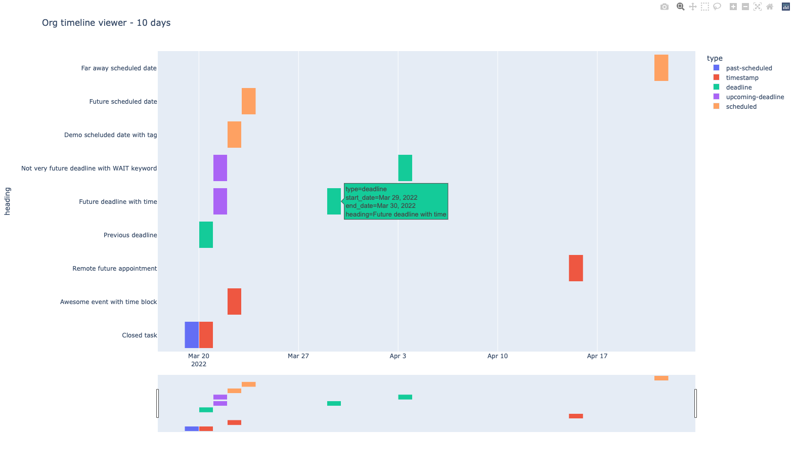

# org-timeline-viewer
Org-timeline-viewer is an interactive timeline visualization generated from Org-mode files.

Visualization is created using Python and external libraries like pandas and plotly. All the commands can be executed inside Org-babel blocks, or as an external script. The end result is an interactive graphic.



# Getting started
In order to generate the timeline, you need to provide a dataset that includes Org-mode timestamps.

Right now, Org-timeline-viewer supports the following options:
- org-timeline-viewer-from-org-table, that takes data from an org-table embedded into the demo file.
- org-timeline-viewer-from-org-batch-agenda-csv, that calls emacs in batch mode to export one of the agenda views to an csv file.

# Requisites
To run org-timeline-viewer, you will need:
- emacs (I'm using Doom Emacs 3.0.0-alpha based on(GNU Emacs 27.2))
- python3
- python libraries: pandas, plotly

If you have Python installed you will probably be able to install those libraries running 'pip3 install pandas plotly' from the command line.

# Installation
Org-timeline-viewer is offered as interactive org-mode documents. You can download the documents from the github repository or clone the repo locally doing:
```
git clone https://github.com/elsatch/org-timeline-viewer.git
```
Once downloaded, open those files in emacs and evaluate the Org-babel blocks using C-c C-c inside each of the blocks. For additional information, check this article [about running Python blocks inside emacs org-mode](https://orgmode.org/worg/org-contrib/babel/languages/ob-doc-python.html).

# Status
Org-timeline-viewer-from-org-table works independently and is the faster way to check the visualization created.

Org-timeline-viewer-from-org-batch-agenda-csv generates a new file using emacs in batch mode. A test file, equivalent to the org-table, is provided. This option will create some temporary files and then plot them using pandas. This option is the most flexible one for testing but I have found several problems producing the tmp_agenda.csv reliabily. See issues for additional information.

# Inspiration
I have used org-mode for almost 25 years in intermitent periods. Right now, I use it for note-taking during my data science courses. Today, I was reading [Sacha Chua's emacs news](https://sachachua.com/blog/2022/03/2022-03-14-emacs-news/) and found one topic of my interest: [how to visualize a timeline from org-mode files](https://www.reddit.com/r/orgmode/comments/t9dix0/how_to_represent_historical_timelines/). Following a conversation with Karl Voit on reddit I decided to give it a try :)
